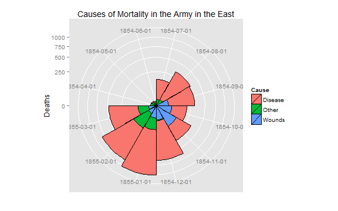
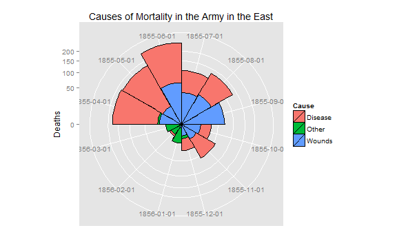

<style>
a {
  color: #08c !important
}

body{
  font-family: 'Oxygen', sans-serif;
  font-size: 16px;
  line-height: 24px;
}

h1,h2,h3,h4 {
  font-family: 'Raleway', sans-serif;
}

.container { width: 900px; }

h3 {
  background-color: #D4DAEC;
    text-indent: 100px; 
}

h4 {
  text-indent: 100px;
}

</style>
  
<a href="https://github.com/timelyportfolio/rCharts_micropolar"></a>

## micropolar Nightingale Coxcombs

As I continue my exploration of all the use cases for Polar Coordinates, I found lots of references to [Florence Nightingale's coxcomb diagrams](http://understandinguncertainty.org/coxcombs).  Below is an image from Wikipedia.


I then rediscovered this nice listing of [R datasets](http://vincentarelbundock.github.io/Rdatasets/index.html) which had a [detailed post](http://vincentarelbundock.github.io/Rdatasets/doc/HistData/Nightingale.html) on the data behind Florence Nightingale's coxcomb plot of mortality during the Crimean War.

With the new [`micropolar` libary](http://micropolar.org) and [rCharts](http://rcharts.io), we should be able to produce an interactive [`d3js`](http://d3js.org) version.  You might notice this is not exactly the same, so consider it a work in progress.  However, here is how you can get close with a few lines of R code.


### Get Data and Dress it Up
Thanks to the [R datasets listing](https://github.com/vincentarelbundock/Rdatasets/) I discovered that there is a `Nightingale` dataset in the `HistData` package.  The data is not big, but this still saved quite of bit of time.


```r
# Thanks to the R datasets github repo
# http://vincentarelbundock.github.io/Rdatasets/doc/HistData/Nightingale.html

library(HistData)
data(Nightingale)


# transform our data to a good format for rCharts
night.df <- data.frame(
  1 : nrow(Nightingale) * 180 / nrow(Nightingale),
  # make numeric javascript date
  as.numeric(as.POSIXct(as.Date(Nightingale[,1])))*1000, 
  apply(Nightingale[,8:10], MARGIN = 1, sum)
)
colnames( night.df ) <- c( "number", "date", "rate" )
night.df$regime <- c(rep('Before', 12), rep('After', 12))
night.df$month <- format(as.Date(Nightingale$Date), "%b %Y")

# For some graphs, it is more convenient to reshape death rates to long format
# we will need in this format for the staced area micropolar chart
require(reshape)
Night<- Nightingale[,c(1,8:10)]
melted <- melt(Night, "Date")
names(melted) <- c("Date", "Cause", "Deaths")
melted$Cause <- sub("\\.rate", "", melted$Cause)
melted$Regime <- ordered( rep(c(rep('Before', 12), rep('After', 12)), 3), levels=c('Before', 'After'))
Night <- melted
Night$Month <- format(Night$Date, "%b %Y")
```


###  Interactive Charts

<div class="row">
<div id = "chart1" class = "span4"></div>
<div id = "chart2" class = "span4"></div>
</div>

Below is the code to generate the charts above.


```r
require(rCharts)

make_dataset = function(data = data){
  lapply(toJSONArray2(data, json = F, names = F), unlist)
}


nightPlot <- rCharts$new()
nightPlot$setLib( path )
nightPlot$set(
  #remove [1:12] if you want Before and After to show on same plot
  data = make_dataset( night.df[1:12, c("month","rate") ] ),  
  #data = make_dataset( x = "Month", y = "Deaths", subset(Night, Regime == "Before") ),
  radialDomain = c( 0, ceiling( max(night.df$rate) ) ),
  angularDomain = 
    night.df$month[1:12],
    #paste0(
    #  "#!d3.time.format('%b %Y')(new Date(",
    #  subset(night.df, regime == "Before")$date[1:12],
    #  subset(Night, Regime == "Before")$Date[1:12],
    #  "))!#"),
  type = "areaChart",
  minorTicks = 0,
  radialTicksSuffix = '',
  height = 300,
  width = 300
)
cat(nightPlot$html(chartId="chart1"))
```

<script>
  var chartParamschart1 = {
 "dom": "chart1",
"width":    300,
"height":    300,
"data": [
 [ "Apr 1854", "8.4" ],
[ "May 1854", "10.8" ],
[ "Jun 1854", "7.2" ],
[ "Jul 1854", "159.6" ],
[ "Aug 1854", "340.8" ],
[ "Sep 1854", "372" ],
[ "Oct 1854", "298.8" ],
[ "Nov 1854", "499.2" ],
[ "Dec 1854", "721.2" ],
[ "Jan 1855", "1173.5" ],
[ "Feb 1855", "979.2" ],
[ "Mar 1855", "561.7" ] 
],
"radialDomain": [      0,   1174 ],
"angularDomain": [ "Apr 1854", "May 1854", "Jun 1854", "Jul 1854", "Aug 1854", "Sep 1854", "Oct 1854", "Nov 1854", "Dec 1854", "Jan 1855", "Feb 1855", "Mar 1855" ],
"type": "areaChart",
"minorTicks":      0,
"radialTicksSuffix": "",
"id": "chart1" 
}
  chartParamschart1.containerSelector = '#chart1'
  micropolar.preset[chartParamschart1.type](
    chartParamschart1
  )
</script>

```r

nightPlot <- rCharts$new()
nightPlot$setLib( path )
nightPlot$set(
  data = make_dataset( night.df[13:24, c("month","rate")] ),
  #data = make_dataset( x = "Month", y = "Deaths", subset(Night, Regime == "After") ),
  radialDomain = c( 0, ceiling( max(night.df$rate) ) ),
  angularDomain = 
    subset(night.df, regime == "After")$month[1:12],
    #paste0(
    #  "#!d3.time.format('%b %Y')(new Date(",
    #  subset(Night, Regime == "After")$Date[1:12],
    #  "))!#"),
  type = "areaChart",
  minorTicks = 0,
  radialTicksSuffix = '',
  height = 300,
  width = 300
)
cat(nightPlot$html(chartId="chart2"))
```

<script>
  var chartParamschart2 = {
 "dom": "chart2",
"width":    300,
"height":    300,
"data": [
 [ "Apr 1855", "216.6" ],
[ "May 1855", "200.9" ],
[ "Jun 1855", "321.7" ],
[ "Jul 1855", "154.5" ],
[ "Aug 1855", "180.7" ],
[ "Sep 1855", "121.9" ],
[ "Oct 1855", "51" ],
[ "Nov 1855", "77" ],
[ "Dec 1855", "38.1" ],
[ "Jan 1856", "24.9" ],
[ "Feb 1856", "11.8" ],
[ "Mar 1856", "13" ] 
],
"radialDomain": [      0,   1174 ],
"angularDomain": [ "Apr 1855", "May 1855", "Jun 1855", "Jul 1855", "Aug 1855", "Sep 1855", "Oct 1855", "Nov 1855", "Dec 1855", "Jan 1856", "Feb 1856", "Mar 1856" ],
"type": "areaChart",
"minorTicks":      0,
"radialTicksSuffix": "",
"id": "chart2" 
}
  chartParamschart2.containerSelector = '#chart2'
  micropolar.preset[chartParamschart2.type](
    chartParamschart2
  )
</script>


<h5>Where is the Stack?</h5>
You might notice that we are missing the stacked area.  With micropolar version 0.1.1, we can now accomplish this also.
<div class="row">
<div id = "chart3" class = "span4"></div>
<div id = "chart4" class = "span4"></div>
</div>


```r
nightPlot <- rCharts$new()
nightPlot$setLib( path )
nightPlot$templates$script = paste(getwd(),"stackedArea.html",sep="/")
nightPlot$set(
  #remove [1:12] if you want Before and After to show on same plot
  data = make_dataset( subset(Night, Regime == "Before")[,c("Month","Deaths","Cause")] ),
  radialDomain = c( 0, ceiling( max(night.df$rate) ) ),
  angularDomain = 
    night.df$month[1:12],
  additionalAngularEndTick = F,
  margin = 35,
  originTheta = -90,
  radialAxisTheta = -30,
  type = "StackedAreaChart",
  minorTicks = 0,
  radialTicksSuffix = '',
  height = 300,
  width = 300
)
cat(nightPlot$html(chartId="chart3"))
```

<script>
  var chartParamschart3 = {
 "dom": "chart3",
"width":    300,
"height":    300,
"data": [
 [ "Apr 1854", "1.4", "Disease" ],
[ "May 1854", "6.2", "Disease" ],
[ "Jun 1854", "4.7", "Disease" ],
[ "Jul 1854", "150", "Disease" ],
[ "Aug 1854", "328.5", "Disease" ],
[ "Sep 1854", "312.2", "Disease" ],
[ "Oct 1854", "197", "Disease" ],
[ "Nov 1854", "340.6", "Disease" ],
[ "Dec 1854", "631.5", "Disease" ],
[ "Jan 1855", "1022.8", "Disease" ],
[ "Feb 1855", "822.8", "Disease" ],
[ "Mar 1855", "480.3", "Disease" ],
[ "Apr 1854", "0", "Wounds" ],
[ "May 1854", "0", "Wounds" ],
[ "Jun 1854", "0", "Wounds" ],
[ "Jul 1854", "0", "Wounds" ],
[ "Aug 1854", "0.4", "Wounds" ],
[ "Sep 1854", "32.1", "Wounds" ],
[ "Oct 1854", "51.7", "Wounds" ],
[ "Nov 1854", "115.8", "Wounds" ],
[ "Dec 1854", "41.7", "Wounds" ],
[ "Jan 1855", "30.7", "Wounds" ],
[ "Feb 1855", "16.3", "Wounds" ],
[ "Mar 1855", "12.8", "Wounds" ],
[ "Apr 1854", "7", "Other" ],
[ "May 1854", "4.6", "Other" ],
[ "Jun 1854", "2.5", "Other" ],
[ "Jul 1854", "9.6", "Other" ],
[ "Aug 1854", "11.9", "Other" ],
[ "Sep 1854", "27.7", "Other" ],
[ "Oct 1854", "50.1", "Other" ],
[ "Nov 1854", "42.8", "Other" ],
[ "Dec 1854", "48", "Other" ],
[ "Jan 1855", "120", "Other" ],
[ "Feb 1855", "140.1", "Other" ],
[ "Mar 1855", "68.6", "Other" ] 
],
"radialDomain": [      0,   1174 ],
"angularDomain": [ "Apr 1854", "May 1854", "Jun 1854", "Jul 1854", "Aug 1854", "Sep 1854", "Oct 1854", "Nov 1854", "Dec 1854", "Jan 1855", "Feb 1855", "Mar 1855" ],
"additionalAngularEndTick": false,
"margin":     35,
"originTheta":    -90,
"radialAxisTheta":    -30,
"type": "StackedAreaChart",
"minorTicks":      0,
"radialTicksSuffix": "",
"id": "chart3" 
}
  chartParamschart3.containerSelector = '#chart3'
  
  var polarPlot = micropolar[chartParamschart3.type]();
  
  chartParamschart3.geometry = polarPlot;
  
  var polarAxis = micropolar.Axis().config(chartParamschart3);
  polarAxis();
</script>

```r

nightPlot <- rCharts$new()
nightPlot$setLib( path )
nightPlot$templates$script = paste(getwd(),"stackedArea.html",sep="/")
nightPlot$set(
  #remove [1:12] if you want Before and After to show on same plot
  data = make_dataset( subset(Night, Regime == "After")[,c("Month","Deaths","Cause")] ),
  radialDomain = c( 0, ceiling( max(night.df$rate) ) ),
  angularDomain = 
    night.df$month[13:24],
  additionalAngularEndTick = F,
  margin = 35,
  originTheta = -90,
  radialAxisTheta= -30,
  type = "StackedAreaChart",
  minorTicks = 0,
  radialTicksSuffix = '',
  height = 300,
  width = 300
)
cat(nightPlot$html(chartId="chart4"))
```

<script>
  var chartParamschart4 = {
 "dom": "chart4",
"width":    300,
"height":    300,
"data": [
 [ "Apr 1855", "177.5", "Disease" ],
[ "May 1855", "171.8", "Disease" ],
[ "Jun 1855", "247.6", "Disease" ],
[ "Jul 1855", "107.5", "Disease" ],
[ "Aug 1855", "129.9", "Disease" ],
[ "Sep 1855", "47.5", "Disease" ],
[ "Oct 1855", "32.8", "Disease" ],
[ "Nov 1855", "56.4", "Disease" ],
[ "Dec 1855", "25.3", "Disease" ],
[ "Jan 1856", "11.4", "Disease" ],
[ "Feb 1856", "6.6", "Disease" ],
[ "Mar 1856", "3.9", "Disease" ],
[ "Apr 1855", "17.9", "Wounds" ],
[ "May 1855", "16.6", "Wounds" ],
[ "Jun 1855", "64.5", "Wounds" ],
[ "Jul 1855", "37.7", "Wounds" ],
[ "Aug 1855", "44.1", "Wounds" ],
[ "Sep 1855", "69.4", "Wounds" ],
[ "Oct 1855", "13.6", "Wounds" ],
[ "Nov 1855", "10.5", "Wounds" ],
[ "Dec 1855", "5", "Wounds" ],
[ "Jan 1856", "0.5", "Wounds" ],
[ "Feb 1856", "0", "Wounds" ],
[ "Mar 1856", "0", "Wounds" ],
[ "Apr 1855", "21.2", "Other" ],
[ "May 1855", "12.5", "Other" ],
[ "Jun 1855", "9.6", "Other" ],
[ "Jul 1855", "9.3", "Other" ],
[ "Aug 1855", "6.7", "Other" ],
[ "Sep 1855", "5", "Other" ],
[ "Oct 1855", "4.6", "Other" ],
[ "Nov 1855", "10.1", "Other" ],
[ "Dec 1855", "7.8", "Other" ],
[ "Jan 1856", "13", "Other" ],
[ "Feb 1856", "5.2", "Other" ],
[ "Mar 1856", "9.1", "Other" ] 
],
"radialDomain": [      0,   1174 ],
"angularDomain": [ "Apr 1855", "May 1855", "Jun 1855", "Jul 1855", "Aug 1855", "Sep 1855", "Oct 1855", "Nov 1855", "Dec 1855", "Jan 1856", "Feb 1856", "Mar 1856" ],
"additionalAngularEndTick": false,
"margin":     35,
"originTheta":    -90,
"radialAxisTheta":    -30,
"type": "StackedAreaChart",
"minorTicks":      0,
"radialTicksSuffix": "",
"id": "chart4" 
}
  chartParamschart4.containerSelector = '#chart4'
  
  var polarPlot = micropolar[chartParamschart4.type]();
  
  chartParamschart4.geometry = polarPlot;
  
  var polarAxis = micropolar.Axis().config(chartParamschart4);
  polarAxis();
</script>


### Static Versions from Rdatasets Post
As a comparison, I just copied the code from [the `HistData` documentation](http://cran.r-project.org/web/packages/HistData/HistData.pdf) which offered a couple static `ggplot2` and `base` plots of the Nightingale data.


```r
##### original code for reference

# For some graphs, it is more convenient to reshape death rates to long format
#  keep only Date and death rates
require(reshape)
Night<- Nightingale[,c(1,8:10)]
melted <- melt(Night, "Date")
names(melted) <- c("Date", "Cause", "Deaths")
melted$Cause <- sub("\\.rate", "", melted$Cause)
melted$Regime <- ordered( rep(c(rep('Before', 12), rep('After', 12)), 3), levels=c('Before', 'After'))
Night <- melted
Night$Month <- format(Night$Date, "%b %Y")
# make numeric javascript date
#Night$Date <- as.numeric(as.POSIXct(as.Date(Night$Date)))*1000

# subsets, to facilitate separate plotting
Night1 <- subset(Night, Date < as.Date("1855-04-01"))
Night2 <- subset(Night, Date >= as.Date("1855-04-01"))

## Not run: 
require(ggplot2)
# Before plot
cxc1 <- ggplot(Night1, aes(x = factor(Date), y=Deaths, fill = Cause)) +
  	# do it as a stacked bar chart first
 geom_bar(width = 1, position="identity", color="black") +
		# set scale so area ~ Deaths	
 scale_y_sqrt() 
		# A coxcomb plot = bar chart + polar coordinates
cxc1 + coord_polar(start=3*pi/2) + 
	ggtitle("Causes of Mortality in the Army in the East") + 
	xlab("")
```

 

```r

# After plot
cxc2 <- ggplot(Night2, aes(x = factor(Date), y=Deaths, fill = Cause)) +
 geom_bar(width = 1, position="identity", color="black") +
 scale_y_sqrt()
cxc2 + coord_polar(start=3*pi/2) +
	ggtitle("Causes of Mortality in the Army in the East") + 
	xlab("")
```

 

```r

# do both together, with faceting
cxc <- ggplot(Night, aes(x = factor(Date), y=Deaths, fill = Cause)) +
 geom_bar(width = 1, position="identity", color="black") + 
 scale_y_sqrt() +
 facet_grid(. ~ Regime, scales="free", labeller=label_both)
cxc + coord_polar(start=3*pi/2) +
	ggtitle("Causes of Mortality in the Army in the East") + 
	xlab("")
```

 

```r

## End(Not run)

## What if she had made a set of line graphs?

colors <- c("blue", "red", "black")
with(Nightingale, {
	plot(Date, Disease.rate, type="n", col="blue", 
		ylab="Annual Death Rate", xlab="Date", xaxt="n",
		main="Causes of Mortality of the British Army in the East");
	# background, to separate before, after
	rect(as.Date("1854/4/1"), -10, as.Date("1855/3/1"), 
		1.02*max(Disease.rate), col="lightgray", border="transparent");
	text( as.Date("1854/4/1"), .98*max(Disease.rate), "Before Sanitary\nCommission", pos=4);
	text( as.Date("1855/4/1"), .98*max(Disease.rate), "After Sanitary\nCommission", pos=4);
	# plot the data
	points(Date, Disease.rate, type="b", col=colors[1]);
	points(Date, Wounds.rate, type="b", col=colors[2]);
	points(Date, Other.rate, type="b", col=colors[3])
	}
)
# add custom Date axis and legend
axis.Date(1, at=seq(as.Date("1854/4/1"), as.Date("1856/3/1"), "4 months"), format="%b %Y")
legend(as.Date("1855/10/20"), 700, c("Disease", "Wounds", "Other"),
	col=colors, fill=colors, title="Cause")
```

 


### Thanks
Thanks to [Chris Viau](http://github.com/biovisualize), [Ramnath Vaidyanathan](http://github.com/ramanthv), and [Vincent Arelbundock](https://github.com/vincentarelbundock).
